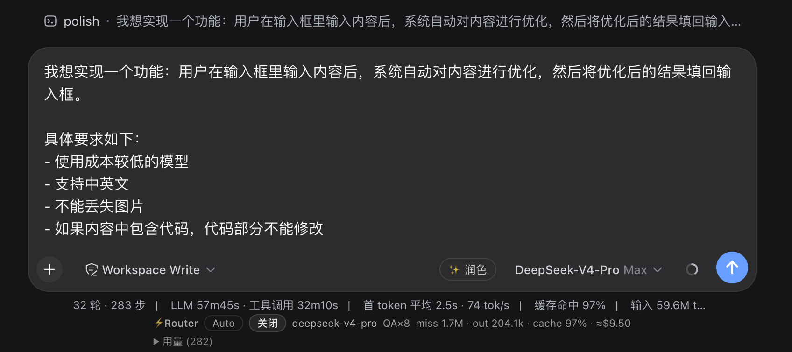

# dsh-composer-polish

One-click draft polisher for the [DeepSeek Harness](https://github.com/deepseek-ai/deepseek-harness) (`dsh`) composer. Type a rambling draft, hit the **✨ 润色 / Polish** button in the input tool row, and a few seconds later the polished text replaces the draft in the input box — you preview, maybe edit, then send. No scoring, no evaluations: draft in → better draft out.

> The harness is in developer preview and iterates quickly — expect compatibility-breaking changes.

> 中文说明见 [README.zh.md](README.zh.md)。

## Features

- **✨ button in the tool row** — sits in `conversation.input.right`, the official seat for clickable controls beside the send button. Disabled while the draft is empty or pure whitespace, shows a spinner while polishing, and never lets double-clicks fire a second request.
- **Zero-prefix flash rewrite** — the host half rewrites the draft with a single `deepseek-v4-flash` stream (`reasoningEffort: 'off'`, ~2000 token cap). The main model never runs and its prefix cache is never touched. If the pinned model id is missing from the provider catalog, it retries once with a flash-class model discovered via `llm.listModels`.
- **Fill-back, not chat** — the polished text goes straight into the input box through `inputActions.setDraft`, the official public draft write path. You can edit it again or polish a second time; nothing is sent until you press send. Image attachments are never touched — only the text is replaced.
- **Fails silent** — a failed or empty rewrite leaves the draft untouched (console log only, no toasts).
- **Privacy** — the `/polish` command registers with `recordInput: false`, so the raw draft never lands in the session log; only the polished result is recorded in `command/done`.
- **No custom wire protocol** — Client→Host rides the harness's built-in `commands` remote (the same channel the shipped `/` commands use).
- **i18n zh/en** — button label and tooltip follow the harness `locale` service.
- **Language and voice follow the draft** — the rewrite answers in the draft's language and keeps the user's voice (it strips filler but won't turn the text more formal, salesy, or robotic); code blocks, file paths, command lines, identifiers, and technical terms stay verbatim.

## Screenshots

The ✨ Polish button in the composer tool row, next to the send button:



## Install

### Prerequisites

The `dsh` CLI must be on your `PATH`. If you only ever ran the harness through `npx`, `dsh` is not installed and you will get `zsh: command not found: dsh` — install it globally first:

```sh
npm install -g @deepseek-ai/dsh
```

`pnpm add -g @deepseek-ai/dsh` also works if your pnpm global bin dir is on `PATH` (otherwise pnpm asks you to run `pnpm setup` first). Alternatively skip the global install and prefix the commands below with `npx @deepseek-ai/dsh …`.

### Add the bundle

```sh
# 1. add the bundle to your web profile (pnpm-backed; the built lib/ artifacts
#    are committed in this repo, so no build script runs at install time)
dsh plugin --profile web add "github:tianji-qingtian/dsh-composer-polish#v0.1.3"

# 2. restart the harness with that profile — `add` only edits the profile
#    files; a running instance does not hot-load the new bundle
dsh --profile web
```

After the restart the ✨ button appears in the composer tool row, next to the send button, and the `/polish` command is registered once the host half loads. Verify under Settings → Plugins that `dsh-composer-polish` is listed.

## How it works

| Piece | Mechanism |
| --- | --- |
| Button seat | `conversation.input.right` list slot (session scope); the standard kit's selector hook `useInput((s) => s)` reads the draft, `inputActions.setDraft()` writes it back |
| Client → Host | built-in `commands` remote, hard-injected (`inject: ['remote', 'remote.commands']`): `ctx.remote.commands.execute(sessionId, '/polish ' + draft)` — the same roundtrip the shipped slash commands use; no custom RPC |
| Host rewrite | `/polish` command handler → zero-prefix `ctx.llm.stream` on `deepseek-official` / `deepseek-v4-flash` (`reasoningEffort: 'off'`, `maxTokens` 2000), one-shot, with a one-time catalog fallback when the pinned model id is unavailable |
| Result channel | handler returns `{ kind: 'success', text }`; the client reads it from `CommandExecution.result.text` and fills it back via `setDraft` |
| Privacy | `recordInput: false` → `command/run` omits `args`, so the raw draft is never written to the session log |
| Stale-edit guard | the client captures `draftRev` at click time; if the draft changed while polishing, the result is discarded instead of clobbering newer edits |
| Draft cap | both halves cap the draft at 50 KB; longer drafts are truncated client-side before sending |

## Behavior spec (from REQUIREMENTS.md)

| # | Scenario | Behavior |
| --- | --- | --- |
| 1 | Non-empty draft, click ✨ | read draft → flash rewrite → fill back |
| 2 | Empty / whitespace-only draft | button disabled |
| 3 | Rewrite fails / returns empty | draft untouched, console log only, no toast |
| 4 | Rewrite in flight | button shows spinner, repeat clicks blocked |
| 5 | Draft has image attachments | only the text is polished; images untouched |
| 6 | Chinese / English draft | rewritten in the draft's language |
| 7 | Code blocks / lists / technical terms | structure kept, code verbatim, no accuracy changes |

## Build

```sh
pnpm install
pnpm build   # tsdown: lib/index.js (ESM host) + lib/client.js (ModuleLoader client bundle)
```

## Known limitations

- The fill-back is skipped when the draft changed during the rewrite (stale-edit guard) — by design, your newer edits always win.
- Drafts over 50 KB are truncated before the rewrite (a draft of that size is beyond what a single flash call can meaningfully restructure anyway).
- The polished result is recorded in `command/done` (the commands channel's own lifecycle log); only the *original* draft is kept out of the log via `recordInput: false`.
- `deepseek-v4-flash` is pinned as the rewrite model; if the harness renames model ids, the catalog fallback picks a flash-class replacement and logs a line.

## License

MIT
